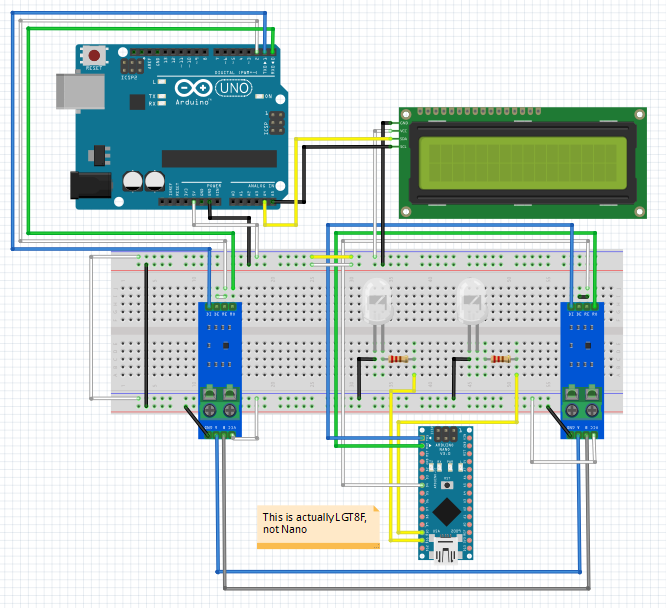

## Modbus RTU communication between two devices

Arduino UNO as master

LGT8F as slave (single or multi slaves)

### Diagram:

### Notes:

#### For client:

First, I have tried "Modbus-Master-Slave-for-Arduino" but this library can't work anymore.

After several trials, I use https://github.com/yaacov/ArduinoModbusSlave

#### For server:

I used my previous sketch here for the UNO. Here: https://github.com/hardwarelayer/arduino/tree/master/uno_modbus_master_test

#### Serial communication characteristics:

Default Serial is inited with 8bits, None parity, 1 stop bits.

Both sides must init with same characteristic (default), or same 2nd parameter for the Serial constructor.

