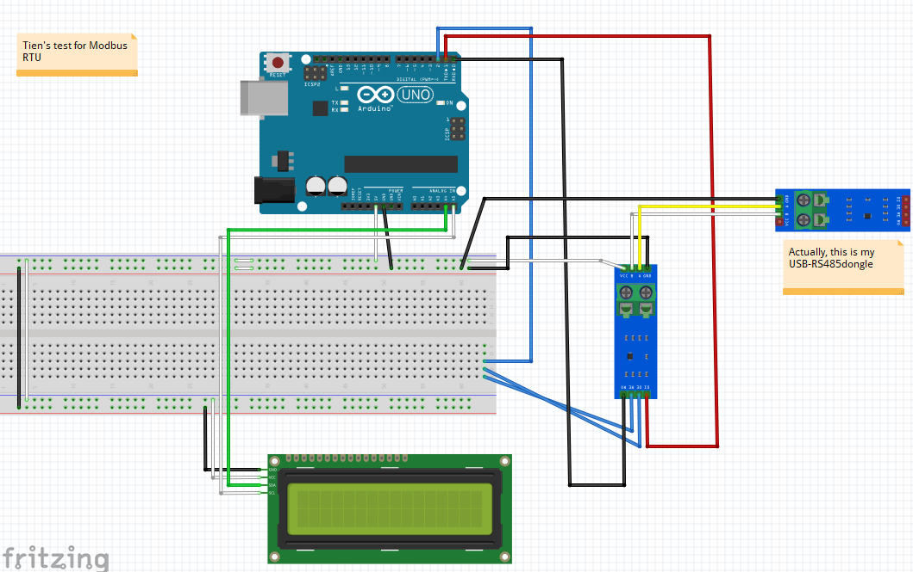

## Modbus master test

Using Arduino UNO as master and PC as slave.

### Diagram:

First, I followed this:
https://circuitdigest.com/microcontroller-projects/rs-485-modbus-serial-communication-with-arduino-as-master

but the library in the article is old and cannot build (error)

so I modified everything

to use the ModBusMaster lib from standard Libraries Manager (https://github.com/4-20ma/ModbusMaster)

### Note: 

USB-RS485 should be removed during flashing Uno

Sometime, TX and RX will block flashing, when failed, remove them.

### Tool on PC:

Free:
	https://www.modbusdriver.com/diagslave.html

	Usage:
		diagslave -b 9600 -p none -m rtu COM5

But this cannot view the register values on realtime.

Trial:

Modbus slave software for PC:

	https://www.modbustools.com/modbus_slave.html <-- trial

